#  Contenido   
1. [TestLink](#testlink-id)  
    1.1 [Instalación](#inst-id)      
    1.2 [Creando Proyecto de Prueba](#prop-id)  
    1.3 [Creando Plan de Prueba](#plan-id)  
    1.4 [Creando Builds](#builds-id)    
    1.5 [Creando TestSuite](#testsuite-id)  
    1.6 [Creando TestCase](#testcase-id)    
    1.7 [Asignación de TestCase a Test Plan](#testplancase-id)  
    1.8 [Crear usuarios y asignar roles](#useroles-id)

    
# 1. TestLink
Testlink es una herramienta gratuita que nos permite gestionar y crear casos de pruebas, estos se organizan en planes de prueba. Los planes de prueba con los casos de prueba asignados, permite a los miembros del equipo ejecutar test case y registrar los resultados dinámicamente, también podemos generar informes eligiendo los parámetros, esta herramienta hace posible que se mantenga una trazabilidad con los requerimientos, así como priorizar y asignar tareas.

TestLink es una herramienta que nos permite:

* La creación de diversos roles con distintos permisos y atributos para los miembros de un equipo de desarrollo
* Poder crear ilimitadamente carpetas en forma de árbol (llamadas requeriment-specification), esto con el fin de tener una mejor organización y agrupamiento de requisitos. 
* Asociar los requisitos con los casos de prueba para mantener una adecuada trazabilidad y un mejor grado de cobertura. 
* Versionar los casos de prueba 
* Tener mapeado de forma ordenada los requisitos.
* Ejecutar los casos de prueba 
* Crear de test-plans para la ejecución y control de las pruebas 
* Fácil integración con herramientas de gestión de incidencias como Mantis, Bugzilla, etc. 
* Generar distintos tipos de reportes: listados de pruebas, requerimientos, resultados por tester, por tipo de prioridad, por importancia, entre otros reportes que hablaremos mas a detalles en las publicaciones siguientes.
* Agregar campos personalizados

**Estructura General.** 

* Proyecto de prueba (Test Project),
* Suite de pruebas (Test Suite).
* Plan de prueba (Test Plan).
* Casos de prueba (Test Case).
* Build.
* Usuario y roles (User). 

   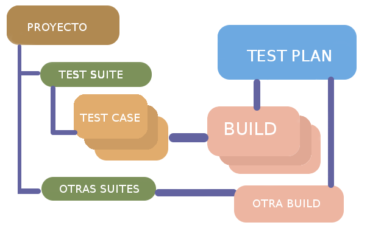

Testlink proyectos agiles

   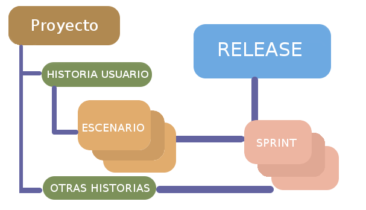 

#### [Ir a Contenido](#content-id)

## 1.1 Instalación

Como pre-requisito tiene que tener instalado el XAMPP. Puede ver como se instala el XAMPP desde la siguiente ruta [Instalación de XAMP](https://www.youtube.com/watch?v=hOivu-XzcpM).

La descarga de XAMP lo puede realizar de [Descarga](https://www.apachefriends.org/es/download.html). 

Para instalar TestLink, revise el siguiente video para ver los pasos [Instalación de TestLink](https://www.youtube.com/watch?v=EGxoUuYL5_8).

La descarga de TestLink lo puede realizar de [Descarga](https://sourceforge.net/projects/testlink/). 

#### [Ir a Contenido](#content-id)

## 1.2 Creando Proyecto de Prueba

* Abra la página de inicio de Testlink e ingrese los detalles de inicio de sesión.          
        `http://localhost:8008/testlink/login.php`

    * Ingrese el ID de usuario: admin
    * Introduce la contraseña: admin

* En la ventana principal, haga clic en `Test Project Management`, se abrirá otra ventana.

     

* Haz clic en la pestaña `create` para crear un nuevo proyecto.
    
         

* Ingrese todos los campos requeridos en la ventana como una categoría para un proyecto de prueba, nombre del proyecto, prefijo, descripción, etc. Después de completar todos los detalles necesarios, haga clic en la pestaña `create` al final de la ventana.

     

Esto creará su proyecto `DE-Test` con éxito.    
     

#### [Ir a Contenido](#content-id)

## 1.3 Creando Plan de Prueba

El plan de prueba contiene la información completa, como el alcance de las pruebas de software, los hitos,los conjuntos de prueba y los casos de prueba.

Video

Para mas información revisar el siguiente enlace [plan de pruebas](https://www.guru99.com/what-everybody-ought-to-know-about-test-planing.html)

* Desde la página de inicio, haga clic en `Test Plan Management` desde la página de inicio.

     

* Se abrirá otra página, en la parte inferior de la página, haga clic en el botón `create`.

     

* Complete toda la información necesaria, como nombre, descripción, crear desde el plan de prueba existente, etc. en la ventana abierta, y haga clic el botón `create`.

     

#### [Ir a Contenido](#content-id)

## 1.4 Creando Builds
Un `Build` es una versión específica de un software.

* Haga clic en `Builds / Releases` en `Test Plan` desde la página de inicio.

    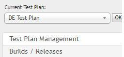 

* En la siguiente ventana, complete todos los detalles necesarios para una versión de software y haga clic en crear para guardar su versión.

    * Ingrese el nombre del título.
    * Ingrese la descripción sobre la versión del software.
    * Marque la casilla de verificación para el estado- Activo.
    * Marque la casilla de verificación para estado - Abrir.
    * Elige la fecha de lanzamiento.
Haga clic en el botón `create`.

   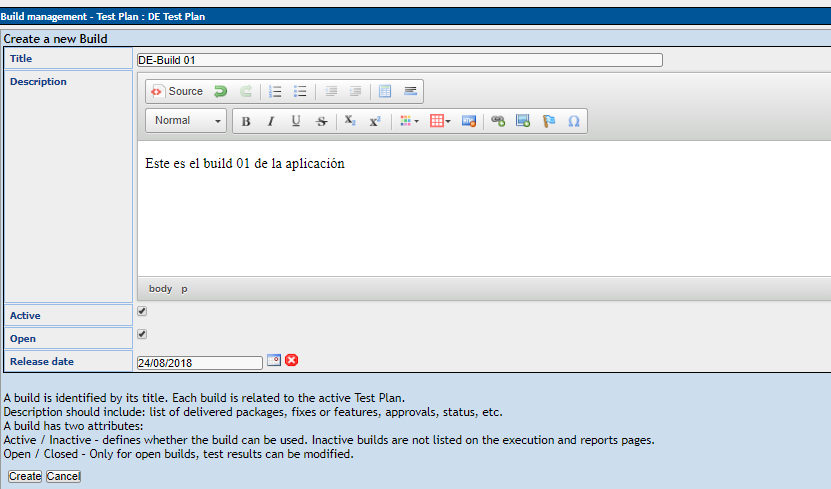

#### [Ir a Contenido](#content-id)

## 1.5 Creando Test Suite
`Test Suite` es una colección de casos de prueba que pueden estar probando o validando el mismo componente. Los siguientes pasos le explicarán cómo crear el conjunto de pruebas para su proyecto.

* Haga clic en la opción `Test Specification` desde la página de inicio.

    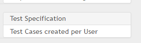

* En el lado derecho del panel, haz clic en el icono de configuración 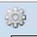. Mostrará una serie de operaciones de prueba.

* Haga clic en la pestaña `create` para el conjunto de pruebas.

    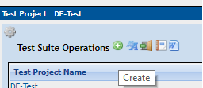

* Complete todos los detalles para el conjunto de pruebas y haga clic en en el botón  `save`.

    * Ingrese el nombre del conjunto de prueba.
    * Ingrese los detalles sobre su suite de prueba.
    * Haga clic en el botón guardar para guardar los detalles de prueba-suite.

    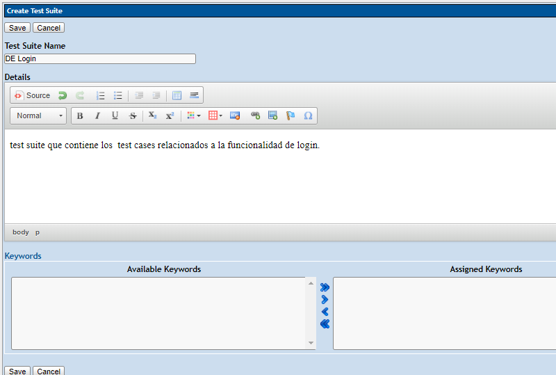

#### [Ir a Contenido](#content-id)

## 1.6 Creando Test Case
`TestCase` contiene una secuencia de pasos de prueba para probar un escenario específico con un resultado esperado. Los siguientes pasos explicarán cómo crear un caso de prueba junto con los pasos de prueba.

* Haga clic en la carpeta de la suite de pruebas en el lado izquierdo del panel debajo de una estructura de árbol de carpetas.

    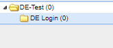

* Haz clic en el icono de configuración  en el panel lateral derecho. La lista de operaciones de casos de prueba se mostrará en el panel lateral derecho

    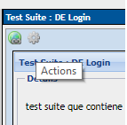

* Se abrirá una nueva ventana, para crear casos de prueba, haga clic en crear un botón en las operaciones de prueba.

    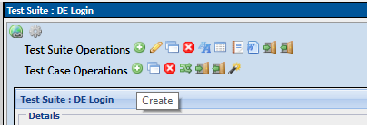

* Ingrese los detalles en la página de especificaciones de casos de prueba.

    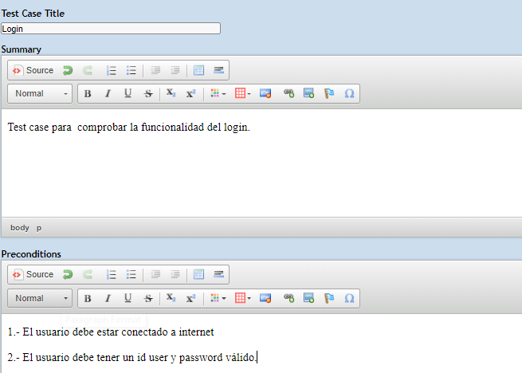

* Después de ingresar los detalles, haga clic en el botón `create` para guardar los detalles. 

    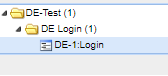

 * Haga clic en el botón `Create step` en un caso de prueba. Se abrirá un editor de paso de caso de prueba.

    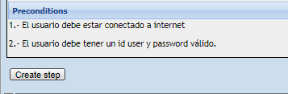

* Se abrirá otra ventana en la misma página, en esa ventana debe ingresar los siguientes detalles.

    * Ingrese el paso de acción para su caso de prueba.
    * Ingrese los detalles sobre la acción de paso
    * Haga clic en `save` y agregue otra acción de paso o haga clic en `save & exit` si no hay más pasos de prueba para agregar.

    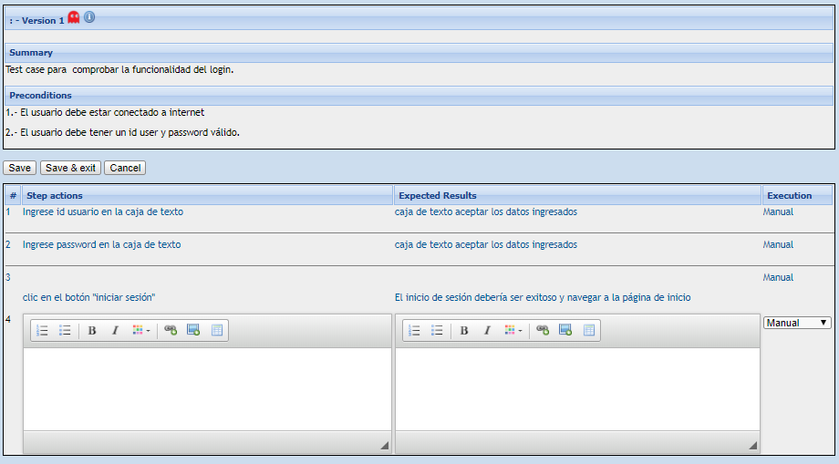

#### [Ir a Contenido](#content-id)

## 1.7 Asignación de TestCase a Test Plan
Para que se ejecute el caso de prueba, debe asignarse al plan de prueba. Aquí veremos cómo podemos asignar un caso de prueba al plan de prueba.

*  Haga clic en el icono de configuración  del `Test Case`. Mostrará la lista de operaciones.

    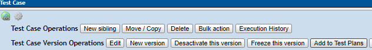

* Se abrirá una nueva ventana, busque su proyecto `DE Test Plan` marque la casilla de verificación y haga clic en el botón `Add`.

    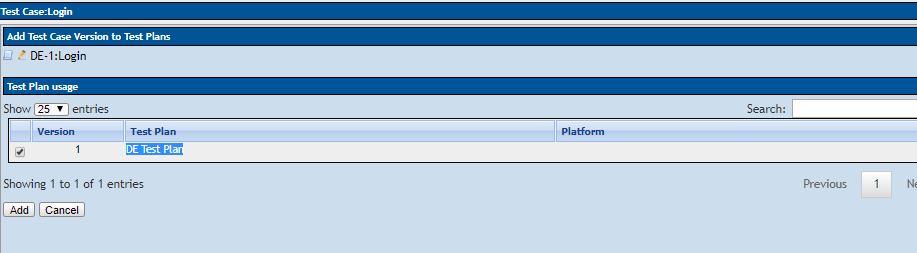

#### [Ir a Contenido](#content-id)

## 1.8 Crear usuarios y asignar roles

#### [Ir a Contenido](#content-id)