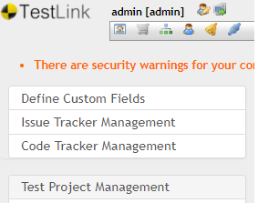
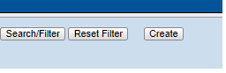
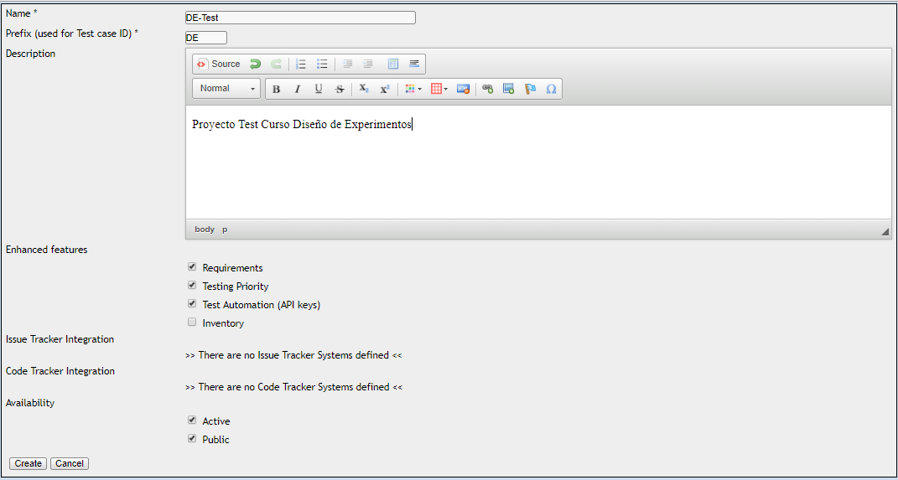
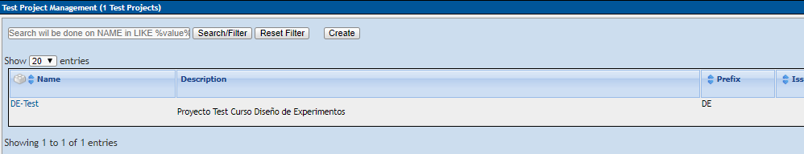
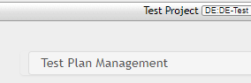
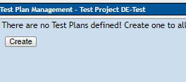
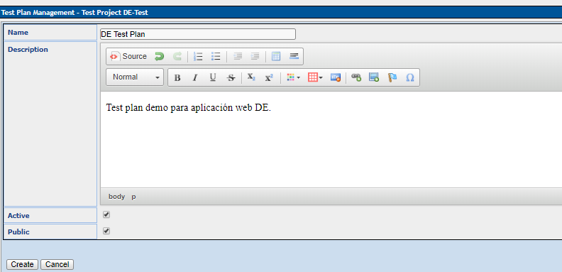

#  Contenido   
1. [TestLink](#testlink-id)  
    1.1 [Instalación](#inst-id)      
    1.2 [Creando Proyecto de Prueba](#prop-id)
    1.3 [Creando Plan de Prueba](#plan-id)

    
# 1. TestLink
Testlink es una herramienta gratuita que nos permite gestionar y crear casos de pruebas, estos se organizan en planes de prueba. Los planes de prueba con los casos de prueba asignados, permite a los miembros del equipo ejecutar test case y registrar los resultados dinámicamente, también podemos generar informes eligiendo los parámetros, esta herramienta hace posible que se mantenga una trazabilidad con los requerimientos, así como priorizar y asignar tareas.

TestLink es una herramienta que nos permite:

* La creación de diversos roles con distintos permisos y atributos para los miembros de un equipo de desarrollo
* Poder crear ilimitadamente carpetas en forma de árbol (llamadas requeriment-specification), esto con el fin de tener una mejor organización y agrupamiento de requisitos. 
* Asociar los requisitos con los casos de prueba para mantener una adecuada trazabilidad y un mejor grado de cobertura. 
* Versionar los casos de prueba 
* Tener mapeado de forma ordenada los requisitos.
* Ejecutar los casos de prueba 
* Crear de test-plans para la ejecución y control de las pruebas 
* Fácil integración con herramientas de gestión de incidencias como Mantis, Bugzilla, etc. 
* Generar distintos tipos de reportes: listados de pruebas, requerimientos, resultados por tester, por tipo de prioridad, por importancia, entre otros reportes que hablaremos mas a detalles en las publicaciones siguientes.
* Agregar campos personalizados

Estructura General. 

Testtlink consta de tres partes fundamentales que se nombran a continuación:

* Proyecto de prueba (Test Project),
* Plan de Pruebas (Test Plan) y el
* Usuario (User). 

Los otros datos son relaciones o atributos de las partes mencionadas lineas arriba.

## 1.1 Instalación

Como pre-requisito tiene que tener instalado el XAMPP. Puede ver como se instala el XAMPP desde la siguiente ruta [Instalación de XAMP](https://www.youtube.com/watch?v=hOivu-XzcpM).

La descarga de XAMP lo puede realizar de [Descarga](https://www.apachefriends.org/es/download.html). 

Para instalar TestLink, revise el siguiente video para ver los pasos [Instalación de TestLink](https://www.youtube.com/watch?v=EGxoUuYL5_8).

La descarga de TestLink lo puede realizar de [Descarga](https://sourceforge.net/projects/testlink/). 

## 1.2 Creando Proyecto de Prueba

* Abra la página de inicio de Testlink e ingrese los detalles de inicio de sesión.          
        `http://localhost:8008/testlink/login.php`

    * Ingrese el ID de usuario: admin
    * Introduce la contraseña: admin

* En la ventana principal, haga clic en `Test Project Management`, se abrirá otra ventana.

     

* Haz clic en la pestaña `create` para crear un nuevo proyecto.
    
         

* Ingrese todos los campos requeridos en la ventana como una categoría para un proyecto de prueba, nombre del proyecto, prefijo, descripción, etc. Después de completar todos los detalles necesarios, haga clic en la pestaña `create` al final de la ventana.

     

Esto creará su proyecto `DE-Test` con éxito.    
     

## 1.3 Creando Plan de Prueba

El plan de prueba contiene la información completa, como el alcance de las pruebas de software, los hitos,los conjuntos de prueba y los casos de prueba.

Video

Para mas información revisar el siguiente enlace [plan de pruebas](https://www.guru99.com/what-everybody-ought-to-know-about-test-planing.html)

* Desde la página de inicio, haga clic en `Test Plan Management` desde la página de inicio.

     

* Se abrirá otra página, en la parte inferior de la página, haga clic en el botón `create`.

     

* Complete toda la información necesaria, como nombre, descripción, crear desde el plan de prueba existente, etc. en la ventana abierta, y haga clic el botón `create`.

     